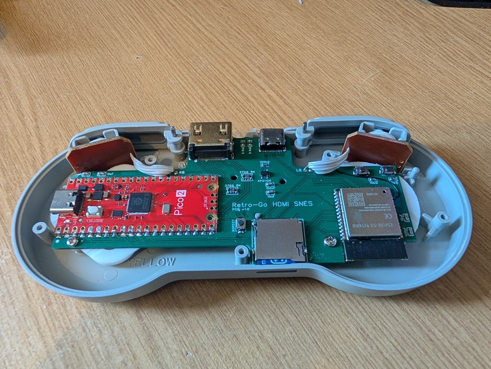
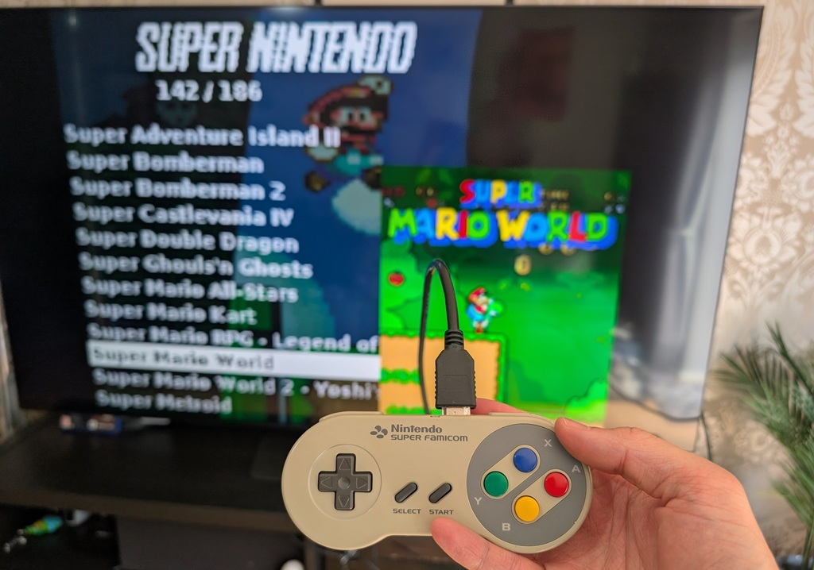

# SPI2HDMI
- Status: Complete
- Design files and BOM: [**Instructables link**](https://www.instructables.com/Retro-Gaming-on-a-ESP32-S3Inside-a-Controller-Outp/)

# Hardware info
- Module: ESP32-S3 N16R8
- HDMI Output via RP2350 [**RP2350 code**](https://github.com/DynaMight1124/SPI2HDMI)
- Powered via USBC or over HDMI
- PCB designed to fit into a SNES Controller

# Images

