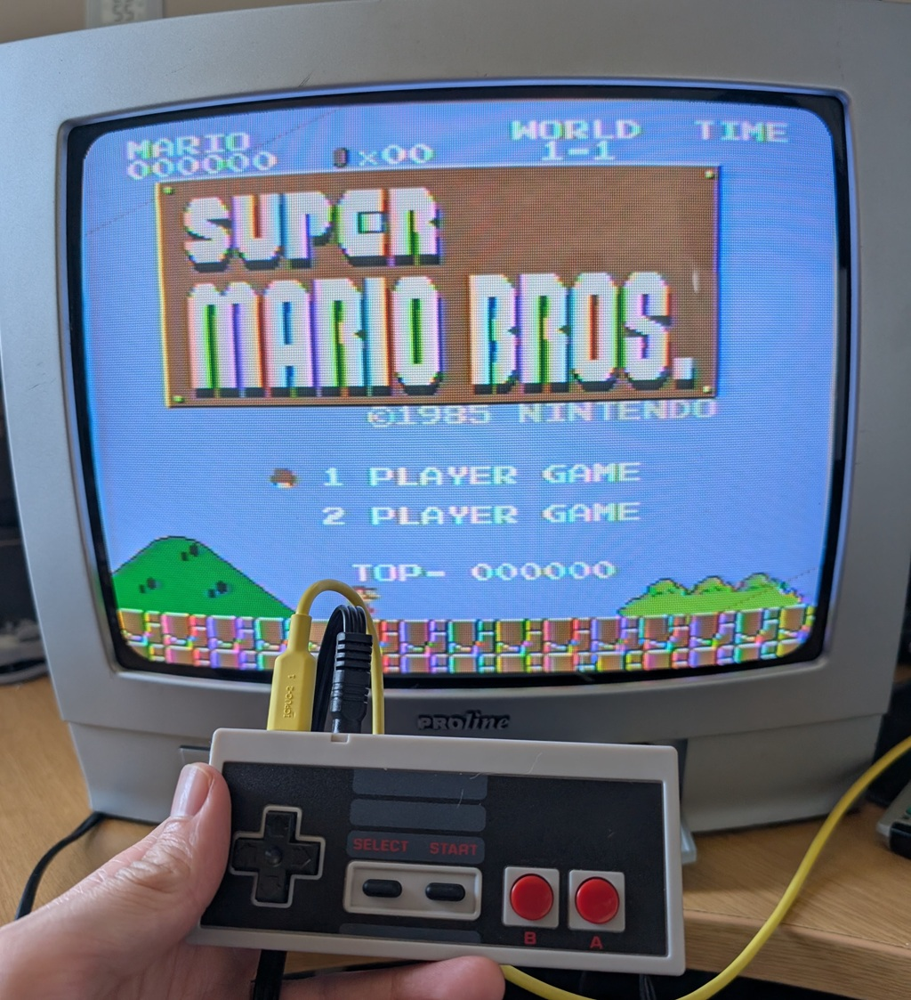
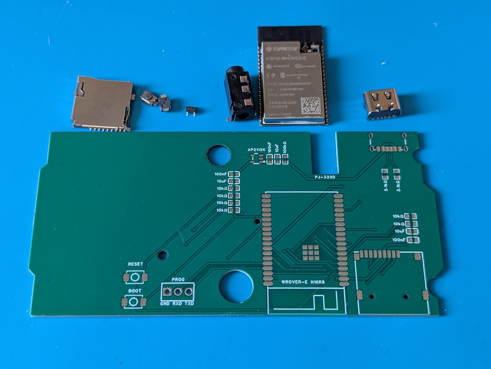

# ESP32-TVOut
- Build Guide & BOM: https://www.instructables.com/NESP32-AV-Play-Retro-Games-From-a-NES-Controller
- Status: Complete

Command to build (ESP-IDF v5.5): `python rg_tool.py --target tvout-esp32 release --no-networking`

## Hardware
- Module: ESP32-WROVER-E (16MB Flash)
- NES Pad: Original or Aftermarket
- 3.5mm AV jack

Powered by USB-C & connects to a TV via composite. 

## Images

